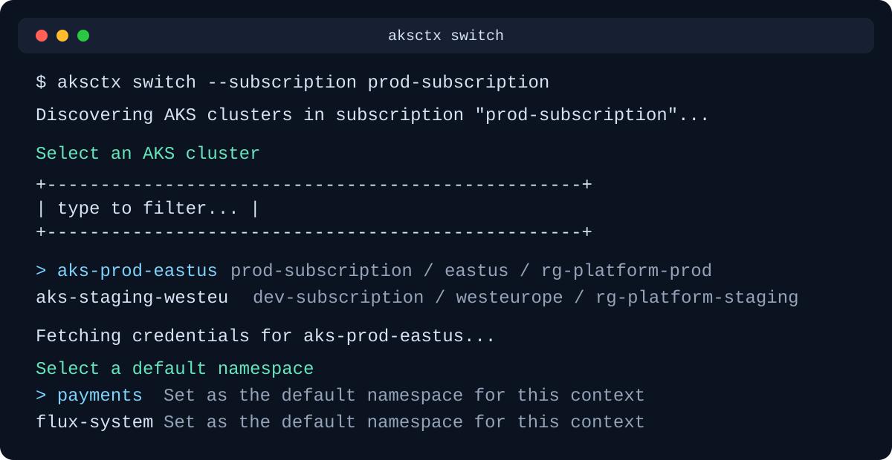
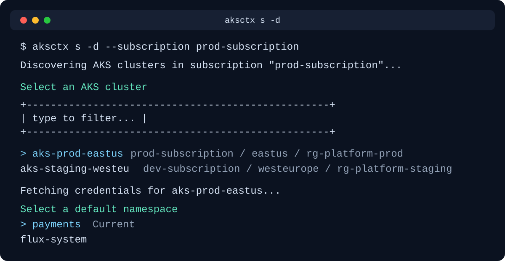
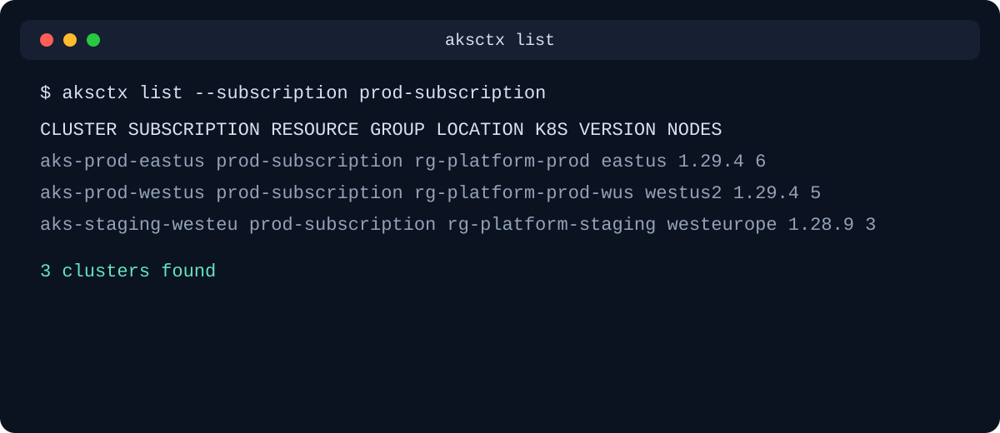
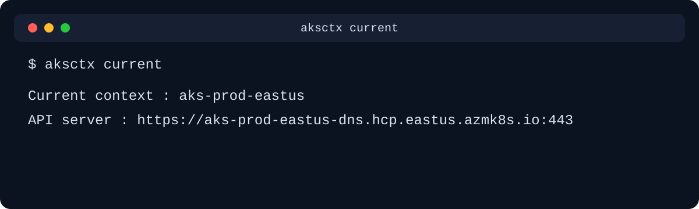
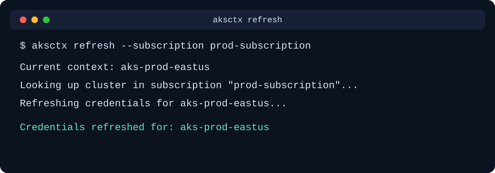

# aksctx

> AKS context switcher — discover and switch between AKS clusters across Azure subscriptions without memorizing resource group names.

```text
$ aksctx s

Select a kubeconfig context
╭──────────────────────────────╮
│ type to filter...            │
╰──────────────────────────────╯

▶ aks-prod-eastus
      minikube
      dev-west

      3/3  ↑↓ navigate  enter select  esc quit

Select a default namespace
╭──────────────────────────────╮
│ type to filter...            │
╰──────────────────────────────╯

▶ payments            Current
      flux-system
      kube-system

✅ Switched to context: aks-prod-eastus
       Cluster       : aks-prod-eastus
       API server    : https://prod.example:443
       Namespace     : payments
```

Use Azure discovery only when you want to find AKS clusters that are not already in your kubeconfig:

```text
$ aksctx s -d

🔍 Discovering AKS clusters...

Select an AKS cluster
╭──────────────────────────────╮
│ type to filter...            │
╰──────────────────────────────╯

▶ aks-prod-eastus      prod-subscription / eastus / k8s 1.29.4 / 6 nodes
  aks-staging-westeu   dev-subscription / westeurope / k8s 1.28.9 / 3 nodes
  aks-dev-eastus        dev-subscription / eastus / k8s 1.28.9 / 2 nodes

  3/3  ↑↓ navigate  enter select  esc quit

✅ Switched to cluster: aks-prod-eastus
   Subscription : prod-subscription
   Resource Group: rg-platform-prod
   Location      : eastus
   K8s Version   : 1.29.4
      Namespace     : payments
```

Limit discovery to a single subscription when you already know its name:

```bash
aksctx s -d --subscription prod-subscription
aksctx list --subscription prod-subscription
aksctx refresh --subscription prod-subscription
```

## Why

Switching between AKS clusters normally requires:

```bash
az aks get-credentials --resource-group rg-platform-prod --name aks-prod-eastus --subscription <uuid>
kubectx aks-prod-eastus
```

You need to know the exact resource group and subscription ID by heart. `aksctx` lets you switch local contexts immediately, and when needed it discovers AKS clusters across all your subscriptions and imports them in one command.

## Commands

- `aksctx switch` or `aksctx s` - Interactive fuzzy picker for existing kubeconfig contexts, then choose a default namespace
- `aksctx switch --discovery` or `aksctx s -d` - Discover AKS clusters from Azure, import credentials, then choose a default namespace
- `aksctx list` - List AKS clusters across subscriptions in a table
- `aksctx current` - Show the current active context and API server
- `aksctx refresh` - Re-fetch credentials for the current cluster

Discovery commands support `--subscription <name>` to restrict the search to one Azure subscription. For `switch`, that flag is only valid with `--discovery`.

## Screenshots

Representative terminal screenshots for each command.

### `aksctx s`



### `aksctx s -d`



### `aksctx list`



### `aksctx current`



### `aksctx refresh`



## Install

**Homebrew (macOS/Linux):**

```bash
brew install amrinder15/tap/aksctx
```

**Windows:**

Download the latest `aksctx` Windows binary from the [GitHub releases page](https://github.com/amrinder15/aksctx/releases).

To publish new Homebrew builds for this tap, create and push a semantic version tag:

```bash
git tag v0.1.0
git push origin v0.1.0
```

That triggers the GitHub Actions release workflow, which builds binaries, creates a GitHub release, and updates the `amrinder15/homebrew-tap` repository automatically.

**Go install:**

```bash
go install github.com/amrinder15/aksctx@latest
```

**Build from source:**

```bash
git clone https://github.com/amrinder15/aksctx
cd aksctx
go build -o aksctx .
mv aksctx /usr/local/bin/
```

## Authentication

`aksctx` uses `DefaultAzureCredential` which tries the following in order:

1. **Environment variables** — `AZURE_CLIENT_ID`, `AZURE_CLIENT_SECRET`, `AZURE_TENANT_ID`
2. **Workload Identity** — for in-cluster or CI use
3. **Azure CLI** — if you've run `az login`
4. **Interactive browser** — fallback; opens a browser window

No extra configuration needed if you've already run `az login`.

After `aksctx` merges AKS credentials into your kubeconfig, it automatically runs:

```bash
kubelogin convert-kubeconfig -l azurecli
```

This keeps AKS contexts ready for Azure CLI-based authentication without a separate manual step.

## Architecture

```text
aksctx s -d
      │
      ▼
DefaultAzureCredential (azidentity)
      │
      ▼
armsubscription.NewSubscriptionsClient
  └─ list all accessible subscriptions
      │
      ▼
armcontainerservice.NewManagedClustersClient (per subscription)
  └─ list all AKS clusters
      │
      ▼
bubbletea TUI picker (fuzzy search)
      │
      ▼
ManagedClusters.ListClusterUserCredentials()
  └─ returns raw kubeconfig bytes
      │
      ▼
client-go clientcmd.Merge
  └─ merges into ~/.kube/config
  └─ sets current-context
                  │
                  ▼
Kubernetes API namespace list
      └─ optional default namespace selection for the new context
```

## Requirements

- Go 1.22+
- Go 1.25+ recommended on macOS 26+
- Azure subscription(s) with AKS clusters
- `az login` or another supported credential method
- `kubelogin` installed and available on your `PATH`

## Troubleshooting

### macOS 26: `missing LC_UUID load command`

If `go run . switch` fails with:

```text
dyld: missing LC_UUID load command
signal: abort trap
```

your Go toolchain is too old for the Mach-O requirements enforced by newer macOS releases. This is a linker/toolchain problem, not an `aksctx` runtime bug.

Use one of these fixes:

1. Upgrade Go to Go 1.25+ and rerun `go run . switch`
2. Let Go auto-select the module toolchain declared in `go.mod`
3. Use a temporary workaround:

```bash
CGO_ENABLED=0 go run . switch
```

You can also force the Apple external linker:

```bash
go run -ldflags='-linkmode=external' . switch
```

## Contributing

PRs welcome. The core logic lives in:

- `internal/azure/clusters.go` — Azure SDK calls
- `internal/tui/picker.go` — bubbletea UI
- `internal/kubeconfig/merge.go` — kubeconfig manipulation
